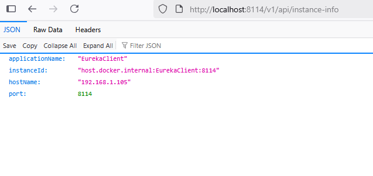
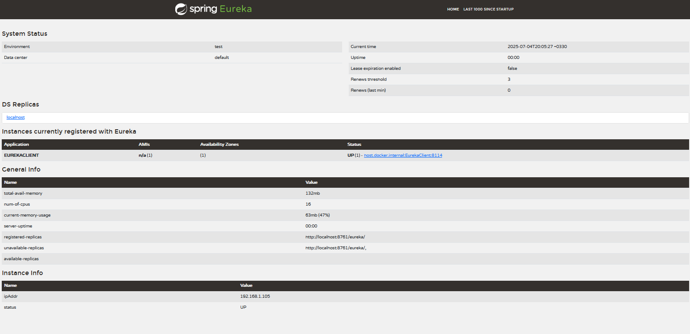
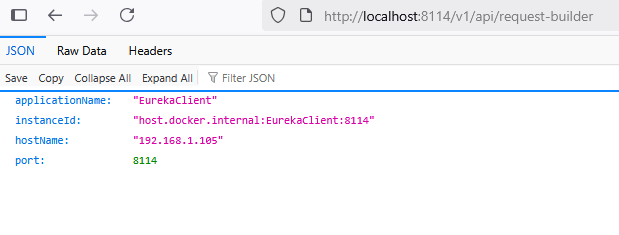
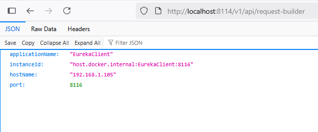

# **DOCS:**

- **Server port:** 8114 
- **Eureka server port:** 8761 (can access via [http://localhost:8761](http://localhost:8761))
- **Eureka server sample project:** [click here](https://github.com/khanjaniAli/EurekaServer)
- This repo contains a simple example of Eureka client. + feign client
- it has an api for show current instance and other info (/v1/api/instance-info):

- registered in Eureka server:

- contain feign client for select host by Eureka load balance (default load balance strategy (round-robin))
- in this case i run 2 instance of this project with port 8114 and 8116 and in order its change host for sending request (/v1/api/request-builder):

- distribute requests onto servers by Eureka load balance